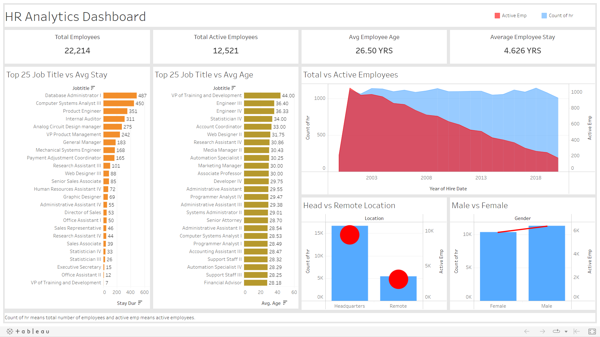

# Human Resource Analytics
Analysis of the employee records for the HR department.

## Tech Stack


## Download

```bash
  git clone https://github.com/Onnamission/Human-Resource-Analytics.git
```

## About
The original procedures like data cleaning and creating new parameters, applied on the HR dataset was directly made through tableau which is not that reliable.

Using SQL is good for insights but when it comes to data cleaning, the SQL code becomes very complex. 

Too much of manual work. Writing so much code you know.

Now here comes the role on R where you just need to define a function in a pipline.

## Data Pipline in R
Defining data pipeline in R for data cleaning.

```bash
  data_clean = df %>%
    na_if(-1) %>%
    na_if(0) %>%
    na_if("") %>%
    drop_na()
```

### About Dataset
The datset is about the employee records in an organization. The dataset is in csv format and contains 1 sheet or say as 1 table.

### Original Methodology
- Data insights using Tableau.
- Data cleaning using Tableau.
- Data visualization using Tableau.

### My Methodology
- Data insights using SQL.
- Data cleaning using R programming.
- Data visualization using Tableau. 

## Data Cleaning

In this dataset, we can't remove all the rows which have blank ("") spaces as we can loss too much of data.

```bash
  clean = dff %>%
  drop_na()
```

The parameter-termdate has many blank spaces is also an important parameter, so i copy-pasted the values of hire_date in the termdate where there are blank spaces.

```bash
  clean$termdate[is.na(clean$termdate)] = clean$hire_date
```
During the data type change in the termdate from character to date, the blanks get converted to NA and then replaced that NA with the hire_date.

The i_id column has id(s) of the employees but in character data type and looks bit complicated. So converted it into 1 - total number of rows.

```bash
  clean$i_id = as.numeric(as.factor(clean$i_id))
```

Renamed sales for the Solutions Engineer Manager to Engineering as it makes more sense.

```bash
  clean$department[clean$jobtitle == "Solutions Engineer Manager"] = "Engineering"
```

Renamed column name into more readable words.

```bash
  colnames(clean) = c("id", 
                    "first_name", 
                    "last_name", 
                    "birth_date", 
                    "gender", 
                    "race", 
                    "department", 
                    "jobtitle", 
                    "location", 
                    "hire_date", 
                    "term_date",
                    "city", 
                    "state", 
                    "age",
                    "active_emp",
                    "stay_dur")
```

Made remanining cleaning at the end.

```bash
  na_if(clean, "")
  aut_data = na.omit(clean)
```

## New Parameters
Using the existing parameter that are:

- birthdate
- hire_date
- termdate

Created 3 new parameters that are:

- age
- active_emp
- sty_dur

Where active_emp means active employees and sty_dur means stay duration.

For age

```bash
  emp_age = time_length(difftime(clean$hire_date, clean$birthdate),"years")
```

For active employees, values where converted into 1 which is greater than 0 and 0 for less than or equal to 0. Thus by getting a sum we could get total active employees. Using total count does not makes sense as it will count total number of rows which will be same as total number of employees.

```bash
  act_emp = time_length(difftime(clean$termdate, clean$hire_date),"years")
```

For stay duration, values which are 0 or less than 0 are converted to 0. Why? logic.

```bash
  sty_dur = time_length(difftime(clean$termdate, clean$hire_date),"years")
```

## Data Type Conversion

All the parameters where is text format. So converted data types are:
- i_id = character to numeric
- birthdate = character to date
- hire_date = character to date
- termdate = character to date

The new parameters created were by default in there correct data types.

## Visualizations

The visualization were made using Tableau.



## 🔗 Links
[](https://public.tableau.com/app/profile/aditya.kakde)

## Disclaimer

If you are using this repository, acknowledging it is important.

## Support

For support, find me 😂.

## Authors

- [@Onnamission](https://www.github.com/Onnamission)


## Acknowledgements

 - [Dataset](https://data.world/markbradbourne/rwfd-real-world-fake-data)

